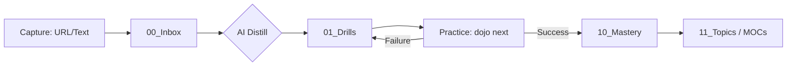

# Knowledge-Dojo 🥋
> **Stop collecting. Start building reflexes.**

[](https://opensource.org/licenses/MIT)
[](https://www.python.org/downloads/)
[](https://obsidian.md/)
[](https://github.com/freubreu88-byte/Knowledge-Dojo/pulls)

**Knowledge-Dojo** is an AI-powered, trainer-first learning system for developers. It bridges the gap between *information hoarding* and *skill mastery* by automatically distilling your Obsidian notes into active recall challenges.

[Features](#-key-features) • [Quick Start](#-quick-start) • [Workflow](#-the-dojo-workflow) • [Comparison](#-why-knowledge-dojo) • [Roadmap](#-roadmap)

---

## 🌊 The Problem: The "Collector's Fallacy"
Most "Second Brain" systems are digital graveyards. We bookmark, we highlight, and we archive—but we rarely **learn**.
*   **Passive reading** results in < 20% retention after 30 days.
*   **Traditional Flashcards (Anki)** are disconnected from your actual notes.
*   **Information Hoarding** creates the illusion of knowledge without the ability to apply it.

**The Solution:** Knowledge-Dojo forces you to **perform**. It's not a library; it's a **gym for your mind.**

---

## ✨ Key Features
- **⚡ AI Distillation**: Feed a YouTube URL or post; Gemini extracts atomic, high-signal drills automatically.
- **🔄 Obsidian-Native**: Your knowledge is stored in plain Markdown. No proprietary databases.
- **📈 Reflex-Based SRS**: Spaced Repetition that prioritizes concepts you struggle with in real-time.
- **📊 Topic Indexing (MOCs)**: Automatic clustering that shows your "Pass Rate" per skill tree.
- **🤖 Agent-Ready**: Built to be navigated and managed by AI Agents (Cursor, Claude, etc.).

---

## 🚀 Quick Start (5-Minute Setup)

### 1. Installation & Environment
```bash
git clone https://github.com/freubreu88-byte/Knowledge-Dojo.git
cd Knowledge-Dojo
python -m venv .venv
.venv\Scripts\activate  # Windows
pip install -e "."
```

### ⚡ Windows One-Click (Recommended)
Simply run **`start_dojo.bat`**. It handles environment setup and guides you through vault creation.

### 2. Initialize your Vault
Connect the Dojo to your Obsidian vault folder:
```bash
dojo init-vault "C:\Path\To\Your\Vault"
```

### 3. Add API Key
Create a `.env` file in the root:
```env
GEMINI_API_KEY=your_active_key
```

---

## 🛠️ The Dojo Workflow



### The Loop:
1.  **Capture**: `dojo capture <url>` (YouTube/Blog/Reddit)
2.  **Distill**: `dojo distill-inbox` (AI creates the challenges)
3.  **Train**: `dojo next` (Start your daily practice session)
4.  **Master**: Concepts are promoted to `10_Mastery` only after verified performance.

---

## ⚖️ Why Knowledge-Dojo?

| Feature | Knowledge-Dojo | Anki | RemNote | Obsidian SR |
| :--- | :--- | :--- | :--- | :--- |
| **Source Context** | High (Linked to Notes) | Low (Fragmented) | Medium | Medium |
| **Automation** | AI-Auto-Generation | Manual | AI-Assisted | Manual |
| **Workflow** | CLI-First (Fast) | GUI-First | Web/App | GUI |
| **Data Ownership** | 100% Markdown | SQLite | Proprietary | 100% Markdown |
| **Agent Support** | Native | None | Low | Low |

---

## 🤖 Agentic Advantage (Advanced Usage)
Knowledge-Dojo is designed for **Agent-Native** learners. Ask your AI Assistant (Cursor/Antigravity):

> *"Update the Security cheat sheet based on my latest Mastery notes."*

The assistant will read your performance data in `11_Topics/` and verified knowledge in `10_Mastery/` to update your `20_Quick_Reference/` folder.

---

## 🗺️ Roadmap
- [ ] **v0.2**: PDF Multi-page distillation.
- [ ] **v0.3**: Web Dashboard for visual progress tracking.
- [ ] **v0.4**: Integration with Anki/Quizlet exports.
- [ ] **v1.0**: Collaborative "Dojo Rooms" for team learning.

---

## 🤝 Contributing
Contributions are what make the open-source community an amazing place to learn, inspire, and create.
1. Fork the Project
2. Create your Feature Branch (`git checkout -b feature/AmazingFeature`)
3. Commit your Changes (`git commit -m 'Add some AmazingFeature'`)
4. Push to the Branch (`git push origin feature/AmazingFeature`)
5. Open a Pull Request

---

## 📄 License
Distributed under the MIT License. See `LICENSE` for more information.

**Level up your mind. Enter the Dojo.**
